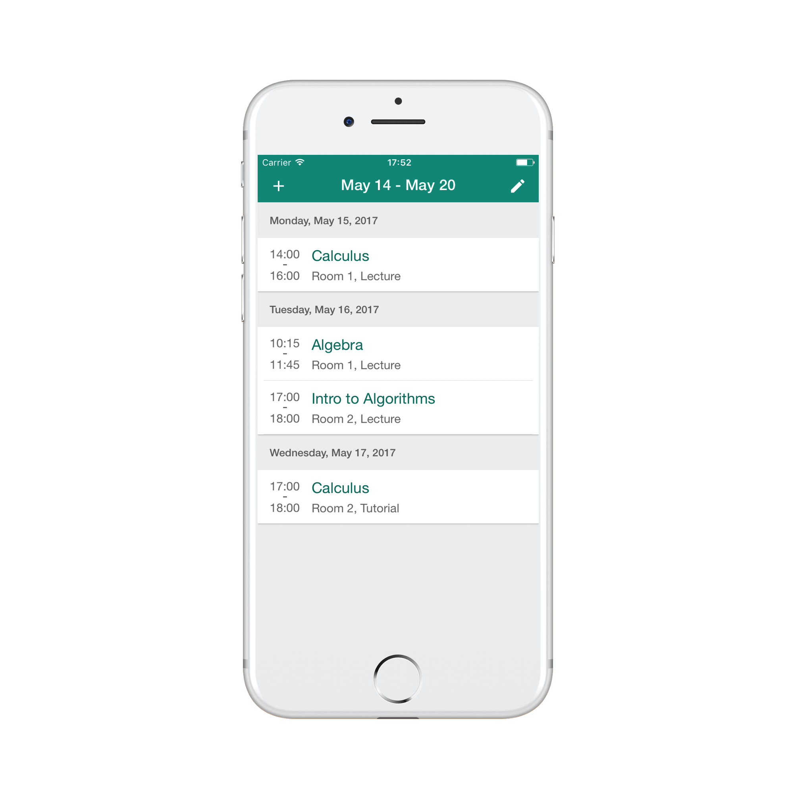

# Clean Timetable

A simple and clean timetable app for iOS.  
Written completely in JavaScript using React Native.

</img>

## What's used

* [React Native](https://facebook.github.io/react-native/)
* Navigation: [React Native Navigation](https://github.com/wix/react-native-navigation)
* State management: [Redux](http://redux.js.org/)
* Forms: [Redux Form](http://redux-form.com/6.7.0/)
* Internationalization: [Moment.js](https://momentjs.com/) and [react-native-i18n](https://github.com/AlexanderZaytsev/react-native-i18n)
* Code style: [ESLint](http://eslint.org/)
* Type checking: [Flow](https://flow.org/)
* Unit testing: [Jest](https://facebook.github.io/jest/) and [Enzyme](http://airbnb.io/enzyme/index.html)

## Translations
Translations are provided in `/src/i18n`.  
In case a translation is not given for some language, english is taken as a fallback.  
To add translations, `english.json` should be taken as reference. 

## Todo

* Fix unit tests (waiting for Enzyme and react-native-mock to support React 16)
* Add documentation

## License

MIT
